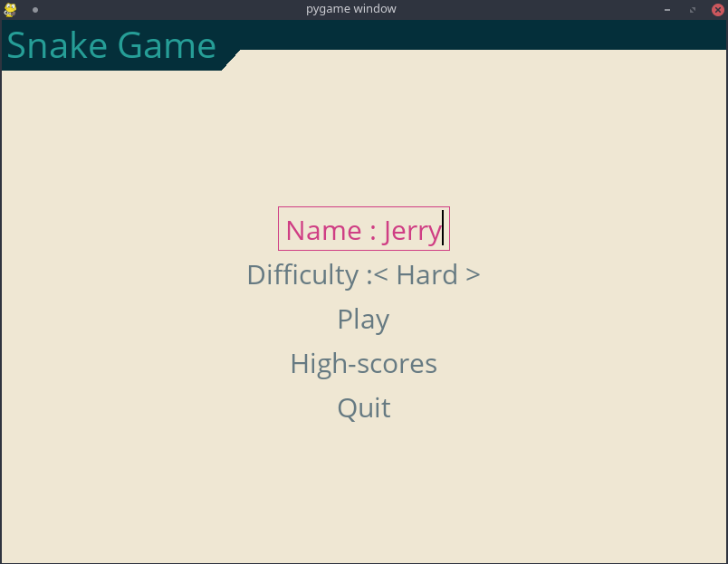
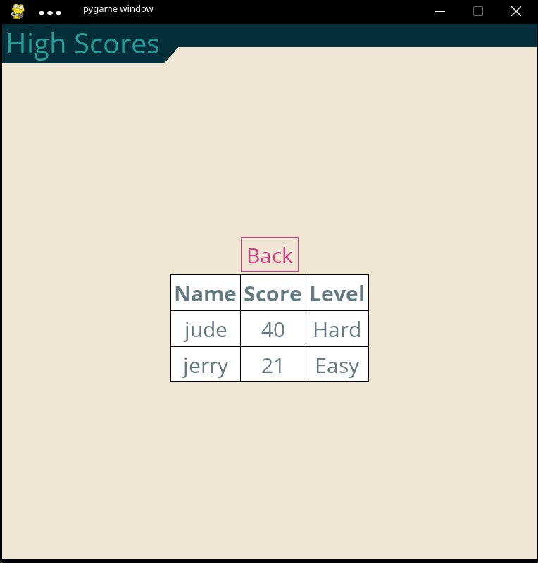

#  **snake-pygame**
Standalone from fork of *Stalinosmj/Snake-game* repository.  
Uses pygame and pygame-menu to make a classic snake game. This repo is mainly used for learning.

### <u>Install required packages by running command in the game directory:</u>

* *pip install -r requirements.txt*

**python3** must be installed in your computer.  
There is a bash script to run the game in venv.
* *./execute.sh*
 
### SCREENSHOTS

## <u>Things to do:</u>
* resolution menu with full screen options
* store highscores permenently
* fix multiple key press snake death issue
* optimise menu section and alignment of widgets
* add bigger fruit which has more points
* change points based on difficulty used
